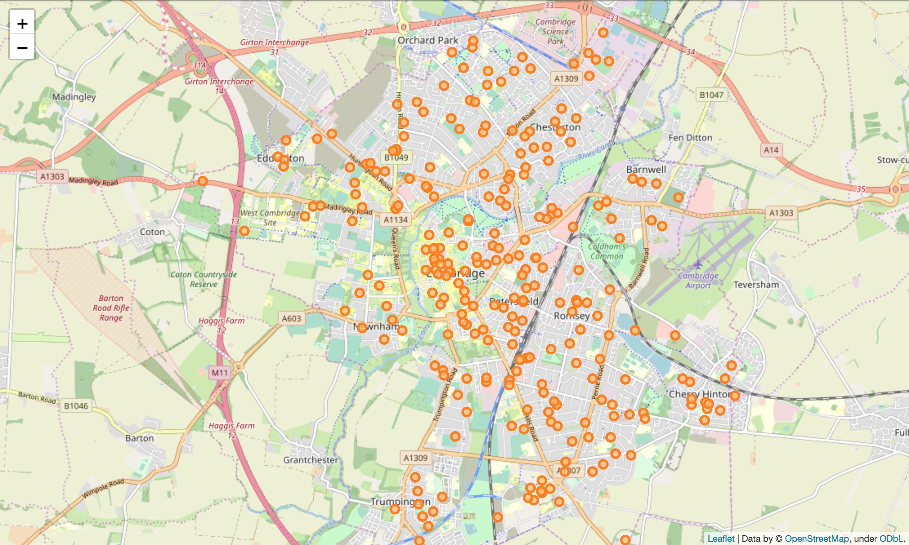
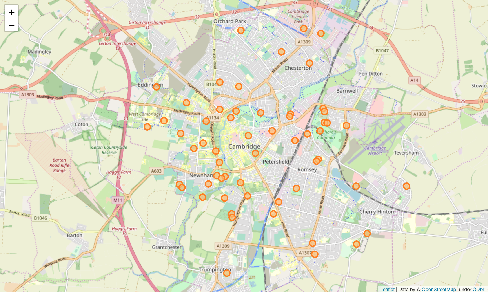
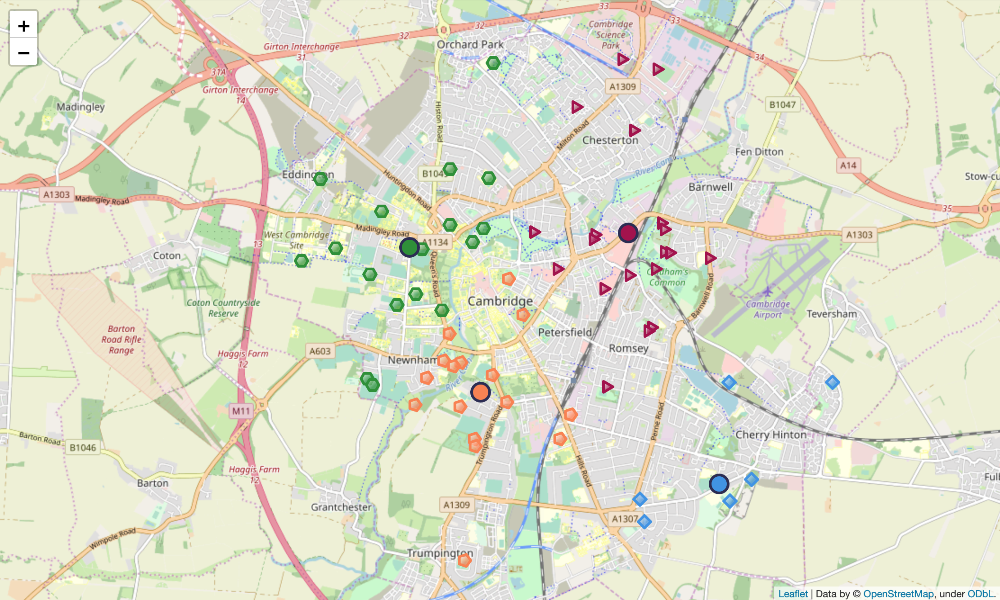

# Coursera Capstone Project - A brand new bicycle shop in Cambridge, UK  
Roberto Preste - 19/06/2019  

## Introduction  

In a few months, I'm moving to Cambridge, UK to start a new job as a software developer. I'm currently looking for a flat, and I'll soon be looking for a bicycle to commute easily and keep healthy.  
This brought me to a simple but stimulating idea for this final project.  

Suppose we may want to open a new bicycle shop in Cambridge, UK. I've already lived there for some time, and from what I've seen, Cambridge is a very biker-friendly city, and it's got plenty of places where people can enjoy a ride on their two-wheeled companion and discover amazing views and fascinating landscapes. We, as brand new entrepreneurs in the bicycle business, we want to exploit the great opportunities that this city offers in order to open our profitable bicycle shop.  

An important consideration we may want to take into account (and that I'll focus on in this project) is to decide where our shop will be located in relation with places where most people riding a bicycle might be found. Specifically, we will look for spots close to the riverside, or parks, or riding routes, or also gyms and sport venues, in order to maximise our profit: if someone (say, a tourist) walks along the river or across a park and sees all those people riding their bikes and having fun, he will possibly think something like "Oh man, I wish I had a bicycle too".  
And there we are, with our brand new shop full of shiny bicycles, that anyone can either buy or rent for a day!
In the same way, it is quite common to find someone whose bike needs a fix in these places, so we may also profit from bicycle repair and maintenance.  

___  

## Data  

First of all, for the sake of simplicity, I chose to focus my attention on the main city of Cambridge, namely neighborhoods whose postcodes start with CB1 up to CB5. So, we'll need all these postcodes and the related neighborhood names; luckily, I found [this great resource](https://www.doogal.co.uk/AdministrativeAreas.php?district=E07000008) which offers these data in the form of a simple CSV file, complete with latitude and longitude coordinates for each postcode.  

We will then use Foursquare to identify local venues such as parks, cycling routes and other places of natural interest where bikers might most commonly be found, as well as gyms and sport venues, because people probably will cycle to these places in order to warm up before attending their favourite sport class.  
We will finally use a clustering approach to further inspect our results, and identify a limited number of candidate locations for our new bicycle shop based on the *centroids* of the clusters found.  

___  

## Methodology  

First of all, I downloaded Cambridge postcode data from [this resource](https://www.doogal.co.uk/AdministrativeAreasCSV.ashx?district=E07000008), and cleaned the datasets as follows:  

- postcodes not currently in use were dropped; 
- only postcodes CB1 to CB5 were retained in order to focus on the main city of Cambridge; 
- only 3 features of the dataset were retained, namely the postcodes and their latitude and longitude coordinates. 

In order to further reduce the data and render them more usable, I chose to "merge" postcodes that were close to each other: I dropped the last character of each postcode (so `CB1 0AA` and `CB1 0AB` would converge to `CB1 0A_`) and took the mean of latitude and longitude of the original postcodes covered by each new truncated postcode.  

The resulting map shows each "postcode group" in Cambridge; it is built (as are all the following maps) using the Folium module:  

  

Using this dataset, I fetched data from Foursquare's API, looking for the 20 closest venues to each postcode and collecting their coordinates and category. These data were then filtered, keeping only venue belonging to one of the categories of interest for our aim, listed below:  

- Gym / Fitness Center
- Gym
- Gym Pool
- Park
- Pool
- Playground
- Soccer Field
- Campground
- Tennis Court
- Canal
- Soccer Stadium
- Golf Course
- Lake
- Hockey Field
- Cricket Ground
- Rugby Stadium
- Harbor / Marina
- River
- Golf Driving Range
- Athletics & Sports
- Field
- Sports Club

Finally, I dropped duplicate venues, which are present because two geographically adjacent postcodes might be close to the same venue(s).  

This is the map that shows each venue of interest for our project:  

  

It seems like interesting places for the bicycle shop are spreaded all around the city, so I decided to cluster these points to obtain just a handful of candidate locations for our new business.  
I arbitrarily divided the Cambridge area into 4 "quadrants", namely North-East, North-West, South-East and South-West, thus creating 4 clusters, based on the geographical coordinates of the venues found. 
I used the `KMeans` class from scikit-learn to perform the clustering, using only the `n_clusters` parameter set to 4.  

The venues dataset was then augmented with the cluster labels created by the k-Means model, and the resulting cluster centroids were used to pin candidate locations for our bicycle shop on the map.  

This is the resulting map, showing the 4 different clusters and their centroids:  

  

___  

## Results  

Looking closely at the map just created, we can make a few observations:  

- since we would like to restrict our view to the main city of Cambridge, we could safely ignore the South-East and North-East candidates, since these clusters' centroids are quite distant from the city centre; 
- with a focus only on the North-West and South-West candidates, the first cluster mostly contains gyms and sporting venues, while the latter hosts a higher number of parks and natural spots. 

With this in mind, the final choice about where our new bicycle shop will be located only depends on our desired customer target: the South-West location might serve tourists (but also locals) wishing to rent a bike for a few hours to explore parks and beautiful natural spots, thus our shop will probably be more focused on many short-term rentals, with few people buying bicycles or seeking one-time maintenance. On the contrary, the North-West location might be more suited for returning customers, who attend sport courses and might come to our shop to ask for repair or maintenance regularly, as well as to buy cycling accessories and apparel.  

___ 

## Discussion  

This study allowed us to quickly gather some information about places that might be of interest for potential customers of our bicycle shop, thus offering some hints as to where our shop's best location could be.  

However, it could still benefit from some tweaking, to further improve these results. For example, we might want to extend our search area to the whole Cambridgeshire, instead of only focusing on CB1-CB5 postcodes. In addition, we might include some other venue categories into our research, such as leisure centres, shopping malls and any other places where people usually cycle to. Lastly, we can decide to think big and actually open a whole chain of bicycle shops instead of just one: this would allow us to increase the number of clusters and consequently serve a higher number of customers in many different locations!  

In order for our business to really be effective, we should also look for existing bicycle shops in our area, so to avoid having to deal with a tight competition with other bicycle shop owners; I'll leave this point for a future follow-up project.  

___ 

## Conclusion  

This project was a simple yet comprehensive introduction on how to work with geographical data and machine learning to effectively answer a business question. Our new bicycle shop will greatly benefit from the data analysis we performed, and hopefully its business will flourish!  

Feel free to edit my project and explore some more possibilities based on these findings.  

___ 

### Disclaimer  

This simple research was my final submission for the [Applied Data Science Capstone](https://www.coursera.org/learn/applied-data-science-capstone/) project from the [IBM Data Science Professional](https://www.coursera.org/specializations/ibm-data-science-professional-certificate) certification offered by [Coursera](https://www.coursera.org).  
Although the idea and development of this project are my own, they are based on lessons and labs completed during the above-mentioned course. This project's only purpose is to show a simple and complete real-world application of Data Science and Machine Learning techniques; no conclusions should be drawn from what is reported here.  

